```mermaid
graph TD
    A[🎯 CURRENT LEVEL] --> B[Kubernetes Expert]
    A --> C[Go Developer]
    A --> D[OSS Contributor]
    
    B --> E[⚡ NEXT LEVEL]
    C --> E
    D --> E
    
    E --> F[CNCF Maintainer]
    E --> G[Cloud Architect]
    E --> H[DevOps Leader]
    
    F --> I[🏆 FINAL BOSS]
    G --> I
    H --> I
    
    I[Industry Influencer]
    
    style A fill:#FF0080,stroke:#fff,stroke-width:2px,color:#fff
    style E fill:#8B5CF6,stroke:#fff,stroke-width:2px,color:#fff
    style I fill:#06B6D4,stroke:#fff,stroke-width:2px,color:#fff
```

<div align="center">

<!-- ULTRA ANIMATED HEADER WITH GLITCH EFFECT -->


<!-- GLITCH TEXT ANIMATION -->
<a href="https://git.io/typing-svg"></a>

<!-- ANIMATED DIVIDER -->


<!-- CYBER PROFILE CARD -->


<!-- PROFILE VIEWS & FOLLOWERS -->
<p align="center">
  
  
  
</p>

<!-- ANIMATED GIF -->


<!-- BANNER BADGES -->
<p align="center">
  
  
  
</p>


</div>

## 🌊 ABOUT THIS DIGITAL ENTITY

<div align="center">

<!-- MATRIX RAIN EFFECT STYLE -->
<a href="https://git.io/typing-svg"></a>

</div>

```go
package main

import (
    "fmt"
    "time"
)

type Developer struct {
    Name           string
    Role           string
    Location       string
    Expertise      []string
    Passions       []string
    CurrentMission string
    Threat_Level   string
}

func main() {
    aditya := Developer{
        Name:     "Aditya Shinde",
        Role:     "Cloud Native Assassin & Open Source Hacker",
        Location: "🇮🇳 India | Operating Globally",
        Expertise: []string{
            "Kubernetes Architecture & Warfare",
            "Go | TypeScript | Python | Bash",
            "Docker & Container Orchestration",
            "CNCF Ecosystem Domination",
            "Distributed Systems & Blockchain",
            "Observability & Chaos Engineering",
        },
        Passions: []string{
            "Breaking Production (and Fixing It)",
            "Contributing to Critical OSS Infrastructure",
            "Kubernetes Policy Engines (Kyverno, OPA)",
            "Building Tools That Scale to Millions",
            "Mentoring Future DevOps Warriors",
        },
        CurrentMission: "Building the future of cloud-native observability",
        Threat_Level:   "💀 EXTREME - APPROACH WITH CAUTION 💀",
    }

    fmt.Printf("🎯 Identity Confirmed: %s\n", aditya.Name)
    fmt.Printf("🚀 Current Mission: %s\n", aditya.CurrentMission)
    fmt.Printf("⚡ Threat Assessment: %s\n", aditya.Threat_Level)
    
    time.Sleep(1 * time.Second)
    fmt.Println("\n💀 WARNING: THIS DEVELOPER CONTRIBUTES TO PRODUCTION CODE 💀")
}
```

<div align="center">

<!-- ANIMATED QUOTE -->


</div>

## 🔥 ARSENAL & WEAPONS OF MASS CREATION

<div align="center">


<!-- ANIMATED TECH STACK -->
<a href="https://git.io/typing-svg"></a>

<!-- SKILL ICONS WITH GLOW -->


<!-- CUSTOM BADGES -->
<p>
  
  
  
  
</p>

<!-- WEAPON DETAILS TABLE -->
| 🗡️ PRIMARY WEAPONS | ⚔️ SPECIAL ABILITIES | 🛡️ DEFENSE SYSTEMS | 🎯 TARGET ZONES |
|:---:|:---:|:---:|:---:|
|  **Golang** | Controllers & Operators |  **Kubernetes** | Cloud Native Apps |
|  **Docker** | Container Orchestration |  **Monitoring** | System Observability |
|  **Linux** | System Administration |  **Git** | Version Control Warfare |


</div>

## 💀 OPEN SOURCE BATTLEGROUND - CONQUESTS & VICTORIES

<div align="center">

<a href="https://git.io/typing-svg"></a>

<!-- MAJOR CONTRIBUTIONS -->
<table>
<tr>
<td align="center" width="33%">
<br/>
<sub><b>🎯 Test Generation Agent</b></sub><br/>
<sub>Core Contributor | Go</sub>
</td>
<td align="center" width="33%">
<br/>
<sub><b>🔐 Blockchain Infrastructure</b></sub><br/>
<sub>Active Contributor | Enterprise DLT</sub>
</td>
<td align="center" width="33%">
<br/>
<sub><b>☸️ Multi-Cluster Orchestration</b></sub><br/>
<sub>Policy Engine Expert</sub>
</td>
</tr>
</table>

<!-- CONTRIBUTION BADGES -->
<p>
  
  
  
  
</p>

<!-- PROJECT LINKS WITH STYLE -->
<p>
  <a href="https://github.com/keploy/keploy">
    
  </a>
  <a href="https://github.com/hyperledger/fabric">
    
  </a>
  <a href="https://github.com/ruxailab/RUXAILAB">
    
  </a>
</p>


</div>

## 📊 BATTLEFIELD STATISTICS & COMBAT METRICS

<div align="center">


<!-- GITHUB STATS -->


<!-- STREAK STATS -->


<!-- PROFILE SUMMARY CARDS -->


<!-- ACTIVITY GRAPH -->


<!-- TROPHIES -->


</div>

## 🐍 CONTRIBUTION SNAKE - DEVOURING COMMITS

<div align="center">

<picture>
  <source media="(prefers-color-scheme: dark)" srcset="https://raw.githubusercontent.com/Ady0333/Ady0333/output/github-contribution-grid-snake-dark.svg">
  <source media="(prefers-color-scheme: light)" srcset="https://raw.githubusercontent.com/Ady0333/Ady0333/output/github-contribution-grid-snake.svg">
  
</picture>


</div>

🎯 CURRENT OPERATIONS & FUTURE TARGETS
<div align="center">
<!-- BIG BOLD HEADING -->
<h1>
  
</h1>
<!-- EXCITING ANIMATED GIF - CODE/HACKING THEME -->

<!-- MULTI-LINE ANIMATED MISSIONS -->
<a href="https://git.io/typing-svg"></a>
<!-- FOCUS AREAS -->
<p>
  
  
  
  
</p>

<!-- GOALS TABLE -->
<table>
<tr>
<td align="center" width="50%">🎯 CURRENT OPERATIONS & FUTURE TARGETS
<div align="center">
<!-- ANIMATED HACKER GIF -->

<!-- MULTI-LINE ANIMATED MISSIONS -->
<a href="https://git.io/typing-svg"></a>
<!-- FOCUS AREAS -->
<p>
  
  
  
  
</p>

<!-- GOALS TABLE -->
<table>
<tr>
<td align="center" width="50%">
<!-- SEPARATOR -->


<!-- CURRENT FOCUS WITH NEON BADGES -->
<h3>⚡ ACTIVE BATTLEFIELD ZONES ⚡</h3>

<p>
  
</p>
<p>
  
</p>
<p>
  
</p>
<p>
  
</p>

<!-- ANIMATED DIVIDER -->


<!-- GOALS IN STYLED CARDS -->
<h3>📋 MISSION CONTROL CENTER</h3>

<table>
<tr>
<td align="center" width="50%">

### 🏆 SHORT TERM OBJECTIVES


```diff
+ ✅ LFX MENTORSHIP → IN PROGRESS
+ ✅ 100+ OSS CONTRIBUTIONS → ACTIVE  
+ ✅ KEPLOY MAINTAINER → TARGETING
+ ✅ CNCF DEEP DIVE → ONGOING
```

<!--  -->

</td>
<td align="center" width="50%">

### 🚀 LONG TERM VISION


```diff
! 🎯 GSOC 2026 → TARGET ACQUIRED
! 🎯 PROJECT MAINTAINER → AMBITION
! 🎯 CLOUD ARCHITECT → VISION  
! 🎯 IMPACTFUL OSS LEADER → MISSION
```

<!--  -->

</td>
</tr>
</table>

<!-- SKILL TREE VISUALIZATION -->
<details>
<summary><b>🗺️ SKILL TREE & UPGRADE PATH (Click to Expand)</b></summary>
<br/>



</details>

<!-- ROADMAP TIMELINE -->
<h3>🛣️ TACTICAL ROADMAP 2026</h3>

<table>
<tr>
<td align="center" width="25%">
<br/>
<sub>📚 Deep Learning Phase</sub><br/>
<sub>Kubernetes CKA/CKAD</sub><br/>
<sub>Advanced Go Patterns</sub>
</td>
<td align="center" width="25%">
<br/>
<sub>🚀 Active Contribution</sub><br/>
<sub>LFX Mentorship</sub><br/>
<sub>Major PR Milestones</sub>
</td>
<td align="center" width="25%">
<br/>
<sub>⚡ Leadership Roles</sub><br/>
<sub>GSoC Participation</sub><br/>
<sub>Conference Talks</sub>
</td>
<td align="center" width="25%">
<br/>
<sub>👑 Maintainer Status</sub><br/>
<sub>Open Source Impact</sub><br/>
<sub>Community Building</sub>
</td>
</tr>
</table>

<!-- POWER METER - USE ONLY THIS ONE VERSION -->
<h3>⚡ CURRENT POWER LEVELS</h3>

<table>
<tr>
<td align="center" width="33%">
<br/>
<br/>
<code>█████████████████░░░</code><br/>
<sub><b>Expert Level</b></sub>
</td>
<td align="center" width="33%">
<br/>
<br/>
<code>████████████████░░░░</code><br/>
<sub><b>Advanced</b></sub>
</td>
<td align="center" width="33%">
<br/>
<br/>
<code>███████████████░░░░░</code><br/>
<sub><b>Proficient</b></sub>
</td>
</tr>
<tr>
<td align="center" width="33%">
<br/>
<br/>
<code>██████████████████░░</code><br/>
<sub><b>Elite Contributor</b></sub>
</td>
<td align="center" width="33%">
<br/>
<br/>
<code>███████████████░░░░░</code><br/>
<sub><b>Advanced</b></sub>
</td>
<td align="center" width="33%">
<br/>
<br/>
<code>████████████████░░░░</code><br/>
<sub><b>Master Tier</b></sub>
</td>
</tr>
</table>

<!-- ACHIEVEMENT UNLOCKS -->
<h3>🏅 RECENT ACHIEVEMENTS UNLOCKED</h3>

<p align="center">
  
  
  
  
</p>

<!-- MOTIVATIONAL QUOTE -->
<h3>💭 CURRENT MINDSET</h3>

<a href="https://git.io/typing-svg"></a>

<!-- END SECTION DIVIDER -->


</div>

## 💬 RECENT COMBAT LOGS & ACHIEVEMENTS

<div align="center">

<!-- GITHUB ACTIVITY -->
<details>
<summary><b>📡 Click to View Recent Activity Feed</b></summary>
<br/>

<!--START_SECTION:activity-->
<!--END_SECTION:activity-->

</details>

<!-- BLOG POSTS -->
<details>
<summary><b>📝 Latest War Stories & Technical Writings</b></summary>
<br/>

<!-- BLOG-POST-LIST:START -->
<!-- BLOG-POST-LIST:END -->

</details>


</div>

## 🌐 ESTABLISH COMMUNICATION LINK

<div align="center">


<a href="https://git.io/typing-svg"></a>

<!-- CONTACT LINKS -->
<p>
  <a href="https://github.com/Ady0333">
    
  </a>
  <a href="https://linkedin.com/in/your-linkedin">
    
  </a>
  <a href="https://twitter.com/your-twitter">
    
  </a>
  <a href="mailto:your-email@example.com">
    
  </a>
</p>

<!-- ANIMATED FOOTER MESSAGE -->
<p>
  
  
  
</p>


</div>

## 🏴‍☠️ FINAL TRANSMISSION

<div align="center">


<a href="https://git.io/typing-svg"></a>

<!-- FOOTER BADGES -->
<p>
  
  
  
</p>

<!-- FINAL ANIMATED DIVIDER -->


<!-- EPIC FOOTER STATEMENT -->
<h3>
  <a href="https://git.io/typing-svg"></a>
</h3>

<p>
  <sub>Built with 💀 by a warrior who believes in the power of open source</sub><br/>
  <sub>© 2026 Aditya Shinde | Licensed under the MIT License of Absolute Freedom</sub>
</p>

<!-- ENDING SIGNATURE -->


</div>
